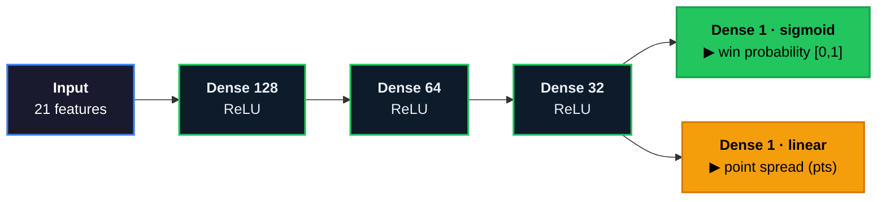
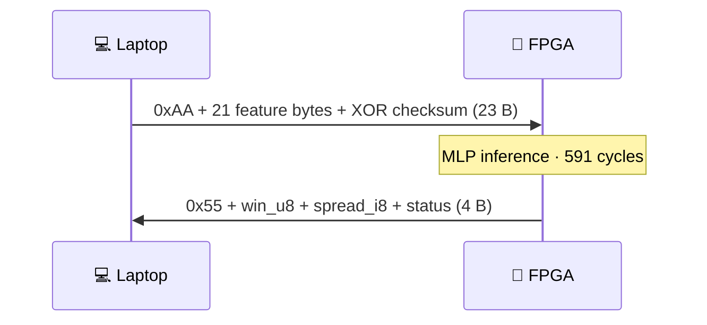

<div align="center">

# 🏈 NFL FPGA Accelerator

**A neural network that predicts NFL games — running on real silicon, not a CPU.**

Train an MLP in Python → quantize it → compile it to Verilog → deploy it on a **Basys 3 FPGA**.
The laptop sends 21 game features over USB-UART; the FPGA runs the whole network in fabric and
returns win probability + point spread in **~12 ms**.


</div>

---

> [!NOTE]
> **The point isn't the football accuracy** — NFL outcomes are close to a coin flip. The point is the
> **complete, verified path from a Keras model to a running hardware accelerator**, proving at every
> step that the silicon computes *exactly* what the software does. That verification story is the
> project.

## ⚡ At a glance

| | |
|---|---|
| 🧠 **Model** | 128→64→32 MLP, dual-head (win + spread), **13,218 params** |
| 🎯 **Accuracy** | **64.5%** win (val) · **9.74 pt** spread MAE — beats the always-home *and* Vegas baselines |
| 🔩 **Fits** | 86% LUT · 20% DSP · 14% BRAM on a \$150 board |
| ⏱️ **Speed** | 591-cycle core inference (~6.25 µs); ~12 ms round-trip incl. UART |
| ✅ **Verified** | **Bit-exact on hardware** — 50/50 games match RTL sim, zero deviation, zero timeouts |

<div align="center">


</div>

---

## 🔬 How it works, end to end

Seven phases. Each has a `PHASE*_COMPLETE.md` writeup with the decisions, bugs, and results in depth.

### 1 · Data & features — `phase1_data/`

Twenty-one features per game, engineered from `nflreadpy` schedule data (order locked forever in
[`artifacts/features.json`](artifacts/features.json)):

| Group | Features |
|---|---|
| **Team strength** | pre-game Elo (home, away) + their difference |
| **Recent form** | rolling 4-game avg of pts scored / allowed / diff · win streak · rest days |
| **Context** | dome · week · season progress · divisional flag · Vegas spread & total · temp · wind |

> [!IMPORTANT]
> **The anti-leakage rule.** Every rolling stat uses **`.shift(1)`**, so game *N* only sees games
> *1…N-1*, and splits are **temporal** (train ≤2020, val 2021–22, test 2023–24). Without this a
> sports model "sees the future," scores beautifully offline, and collapses in production. Elo is
> stored **pre-game**, never post-game, for the same reason.

### 2 · Model — `phase2_model/`

A small MLP with a **shared trunk** that splits into **two heads** — one classifier (win) and one
regressor (spread):

<div align="center">



*Dropout(0.2) sits between the hidden layers during training only — it vanishes at inference, so it
never reaches the hardware.*

</div>

> 💡 That **shared 32-unit trunk feeding two heads** is exactly what deadlocked the first FPGA build:
> in `io_serial` mode the two heads fought over one stream. See [Phase 4](#4--hls--rtl--phase4_hls).

**13,218 parameters** — tiny on purpose (the 50k budget is what the board's 90 DSPs / 1.8 Mb BRAM can
hold). Three choices are made **for the hardware, not the math**:

- 🟢 **ReLU-only hidden layers** — `max(0, x)` is *one comparator* in silicon; tanh/sigmoid would cost a
  lookup table per neuron.
- 🟢 **MinMaxScaler → [0, 1]** (not StandardScaler) — a [0,1] value drops straight into an unsigned
  8-bit fixed-point byte (`byte/256`), which is exactly how a feature crosses the UART.
- 🟢 **Dropout** is training-only → **zero** hardware cost at inference.

<div align="center">

| Metric | Validation (2021–22, 543 games) | Baseline |
|:---|:---:|:---|
| **Win accuracy** | **64.5%** | always-home 53.6% · target ≥63% |
| Win AUC | 0.710 | — |
| **Spread MAE** | **9.74 pts** | Vegas opening line 9.76 — model edges it |

</div>

*Source: [`phase2_model/PHASE2_COMPLETE.md`](phase2_model/PHASE2_COMPLETE.md). Test-set (2023–24) win
accuracy is 70.2%, but validation is the honest headline — see [Limitations](#-honest-limitations).*

### 3 · Quantization — `phase3_quantization/`

FPGAs do fixed-point, not float. The model is rebuilt in **QKeras** with quantization-aware training
and weights snapped to a fixed-point grid (8-bit weights, `<8,4>` ReLU activations — deployed
precision in [`artifacts/hls_config.json`](artifacts/hls_config.json)). Because the network *trained
knowing it would be quantized*, the cost is almost nothing:

> **Float → quantized:** win accuracy **−0.2%**, spread MAE **+0.01 pts** — both inside tolerance.
> *(source: [`phase3_quantization/PHASE3_COMPLETE.md`](phase3_quantization/PHASE3_COMPLETE.md))*

### 4 · HLS → RTL — `phase4_hls/`

`hls4ml` emits C++; Vitis HLS synthesizes it to Verilog for the `xc7a35tcpg236-1` part. One inference
= **591 cycles (~6.25 µs @ 100 MHz)** (source: HLS `csynth.rpt`).

> [!WARNING]
> **The bug that taught me the most.** The first build (`io_type='io_serial'`) **deadlocked in
> hardware**: the final hidden layer feeds *both* output heads, and that shared stream starved one
> head's FIFO, hanging the pipeline. Fix: regenerate as **`io_stream`** (AXI4-Stream), which splits
> the shared stream via `nnet::clone_stream`. Caught in **cosimulation** ("max stream depth = 1" → every
> FIFO drains) — it never reached the board.

### 5 · FPGA integration — `phase5_fpga/`

Hand-written Verilog wraps the MLP IP into a complete design:

```
top.v
├── uart_rx.v         8N1 receiver @115200 baud, metastability-hardened
├── uart_tx.v         8N1 transmitter
├── uart_framing.v    SOF detection · XOR checksum · response sequencer
├── mlp_controller.v  AXI-Stream feature push · ap_ctrl_hs handshake · result capture
│                     · win saturation · watchdog (reports a timeout instead of hanging)
└── myproject         the hls4ml MLP IP
```

<div align="center">

**Synthesis sign-off** — Vivado 2025.2 *(source: [`artifacts/synthesis_report.json`](artifacts/synthesis_report.json))*

| Resource | Used | Available | Utilization |
|:---|---:|---:|:---:|
| **LUT** | 17,888 | 20,800 | **86.0%** 🟡 |
| FF | 29,824 | 41,600 | 71.7% |
| BRAM | 7 | 50 | 14.0% 🟢 |
| DSP | 18 | 90 | 20.0% 🟢 |
| **WNS** | **+0.126 ns** | — | **✅ closes @ 100 MHz** |

</div>

> 💡 The HLS *estimate* screamed 138% LUT — a ~38% overcount. The real gate is the Vivado
> post-implementation number, which fits with room to spare.

### 6 · Verification — `phase6_sim/`

A ladder of tests, each catching a different failure mode:

```
① Unit tests ........ each UART/framing/controller module alone      (cocotb + iverilog)
② HLS C-sim ......... C++ model == Python
③ HLS cosim ......... generated RTL == C++            ← the deadlock fix was proven here
④ XSIM regression ... real IP + real controller, 50 games vs golden  → bit-exact, 0 timeouts
```

The golden is computed on `byte/256` inputs (**what the hardware actually sees**), so any mismatch is
a *hardware* bug — not an input-quantization artifact hiding in the test.

### 7 · Deployment & on-board bring-up — `phase7_deploy/`

The laptop side: a `pyserial` client, feature encoding, board programming, validation, and **two UIs**
(a Tkinter desktop app and a local web app with an animated win-probability gauge).

> [!TIP]
> **The result that matters:** all 50 games run through the *physical board* came back
> **byte-for-byte identical** to the XSIM simulation — `win |max| = 0`, `spread |max| = 0`, zero
> timeouts. The silicon reproduces the verified RTL exactly.
> *(detail: [`phase7_deploy/PHASE7_COMPLETE.md`](phase7_deploy/PHASE7_COMPLETE.md))*

<details>
<summary><b>Neat engineering detail: how the UI dodges the WSL/Windows split</b></summary>

Feature encoding needs pandas + the scaler (WSL only), but the board's COM port lives on Windows —
so a single "build features and talk to the board" app can run in *neither* environment. Instead of
fighting `usbipd` USB-forwarding into WSL, the feature bytes for **every game are precomputed once**
(in WSL) into `games_catalog.json`. The UIs then need only `pyserial` and run natively on Windows
against the COM port. The data stack and the serial stack never have to coexist.
</details>

---

## 📡 Communication protocol

<div align="center">



</div>

`win_prob = win_u8 / 256` (home team's probability) · `spread` = signed int8 · `status` =
`0x00` OK / `0x01` checksum NACK / `0x02` watchdog timeout. The `0xAA`/`0x55` start-of-frame markers
let the receiver resync after a dropped byte or a mid-stream power-on.

---

## 🚀 Running it yourself

**You need:** Python 3.12 — plus, for the hardware path, a Basys 3 + Vivado 2025.2 (free WebPACK).
Everything except the physical board and the (regenerable) bitstream is in the repo.

<details open>
<summary><b>Software / model path</b></summary>

```bash
python -m venv venv && source venv/bin/activate
pip install -r requirements.txt
python phase1_data/pipeline.py          # nflreadpy → data/processed/games.parquet
python phase2_model/train.py            # → artifacts/model_best.keras (already committed)
python phase3_quantization/quantize.py
pytest tests/ -v
```
> [!NOTE]
> `data/processed/games.parquet` is **not committed** (regenerable; `nflreadpy` needs internet) —
> run `pipeline.py` first or the feature tests skip/fail. The trained artifacts
> (`model_best.keras`, `scaler.pkl`, `features.json`) **are** committed and are the source of truth.
</details>

<details>
<summary><b>FPGA / hardware path</b></summary>

```bash
# 1) synthesize the bitstream — the IP is committed under artifacts/ip_repo/
#    (edit the absolute paths in phase5_fpga/scripts/*.tcl for your machine first)
vivado -mode batch -source phase5_fpga/scripts/create_project.tcl
vivado -mode batch -source phase5_fpga/scripts/run_synth.tcl

# 2) program the board (Vivado Hardware Manager → top.bit), then run inference:
python phase7_deploy/board/verify_uart.py COM8             # smoke test
python phase7_deploy/validation/golden_vector_test.py COM8 # 50-game bit-exact check
python phase7_deploy/ui/webapp.py                          # web UI → http://127.0.0.1:8713
```
> [!WARNING]
> The bitstream (`*.bit`) is **not committed** (large, board-specific) — build it from the committed
> IP + HDL. A few build/program scripts have **hardcoded Windows paths** (`C:\nfl_fpga_build\...`,
> `C:\Xilinx\...`) that need editing for your environment.
</details>

---

## 🗂️ Repo map

| Path | Contents |
|---|---|
| `phase1_data/` … `phase7_deploy/` | The seven phases — each with its own `PHASE*_COMPLETE.md` deep-dive |
| `artifacts/` | **Committed & sacred:** `model_best.keras`, `scaler.pkl`, `features.json`, synthesized `ip_repo/` |
| `phase5_fpga/hdl/` | The hand-written Verilog (UART · framing · controller · top) |
| `phase6_sim/` | cocotb unit tests + the XSIM functional regression |
| `phase7_deploy/ui/` | Tkinter desktop app + local web app |
| `tests/` | pytest suites, one per phase |

---

## ⚖️ Honest limitations

> [!WARNING]
> - **Prediction quality is modest by design.** ~64.5% val accuracy and ~9.7 pt MAE sit near the
>   practical ceiling for NFL prediction from schedule-level features — this is a *systems* project,
>   not a betting edge.
> - **The board is volatile** — the bitstream reloads on every power cycle, and the USB-UART port can
>   drop on a loose connection.
> - **Not fully clone-and-go for hardware** — you synthesize the bitstream yourself, own a Basys 3,
>   and adjust a few hardcoded paths. The software/model half *is* reproducible from `nflreadpy`.

---

<div align="center">

### 🛠️ Stack

**Python** · nflreadpy · pandas · numpy · scikit-learn · TensorFlow/Keras · QKeras · hls4ml · pyserial · pytest
**FPGA** · Vivado / Vitis HLS 2025.2 · Verilog · Basys 3 (Artix-7 XC7A35T) · USB-UART @ 115200 baud

*From `pandas` to `.bit` — and verified bit-exact on the way down.*

</div>
