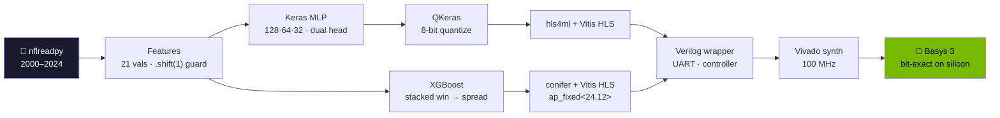

<div align="center">


<!-- ── HERO DEMO ────────────────────────────────────────────────────────────
     Add docs/assets/demo.gif, then delete this comment wrapper.
     See docs/assets/README.md for exactly what to capture and why it matters.


────────────────────────────────────────────────────────────────────────── -->


</div>

## What this is

**A football predictor that runs as a physical circuit instead of as code.**

Two machine-learning models are trained in Python, then compiled all the way down into
digital logic and loaded onto an FPGA — a chip whose wiring is reconfigurable, so the model
stops being software and becomes actual gates on silicon. No CPU, no operating system, no
inference library at runtime.

You pick an NFL game on a web page. Its 21 features go out over a USB cable, the chip
computes the whole model in hardware, and a few milliseconds later a win probability and a
point spread come back.

Most ML "deployment" means putting a model in a container. Here it means the multiplications
are wires. The interesting engineering is in that translation — and in proving, at every
stage, that the silicon produces bit-for-bit the same answer the Python did.

The football accuracy is deliberately not the headline. NFL outcomes are close to a coin
flip, and both models land exactly at the data's noise floor. What the project demonstrates
is the verified path from `model.fit()` down to a bitstream, walked twice with two very
different model families: a neural network via hls4ml, and a gradient-boosted forest via
conifer, sharing one dataset and one locked feature set.

## Results

<table align="center">
<tr align="center">
  <td><h2>100/100</h2></td>
  <td><h2>22</h2></td>
  <td><h2>0</h2></td>
</tr>
<tr align="center">
  <td>games bit-exact on hardware<br/><sub>vs. simulation, zero tolerance</sub></td>
  <td>clock cycles per inference<br/><sub>GBDT track, at 100 MHz</sub></td>
  <td>DSP blocks used<br/><sub>the whole GBDT is LUTs</sub></td>
</tr>
</table>

Both tracks were built end to end and deployed to the same board.

| | MLP (hls4ml) | GBDT (conifer) |
|---|---|---|
| Model | 128→64→32 dual-head, 13,218 params, 8-bit QAT | Stacked XGBoost, 132 × depth-2 win + 31 × depth-3 spread |
| Win accuracy — val (543 games) | 64.5%, AUC 0.710 | **65.8%**, AUC **0.716** |
| Win accuracy — test (544 games) | 70.2%, AUC 0.724 | 70.2%, AUC **0.731** |
| Spread MAE — val / test | **9.74** / 9.86 | 9.758 / **9.776** |
| Fixed-point fidelity | 8-bit QAT, −0.2% accuracy | `ap_fixed<24,12>`, 99.26% agreement |
| Post-route fit | 17,888 LUT (86%), 18 DSP, 7 BRAM | **12,095 LUT (58%), 0 DSP, 0.5 BRAM** |
| Timing | WNS +0.126 ns | WNS **+0.965 ns** |
| Inference | 1,494 cycles (591 in the IP core) | **22 cycles** |
| Board vs simulation | 50/50 bit-exact, ±2-count tolerance | **100/100 bit-exact, zero tolerance** |
| Round-trip | **3.4 ms** (23-byte packet) | 6.9 ms (65-byte packet, line-time bound) |

Both models tie the Vegas opening line on spread (9.76) and neither beats it. That is the
data's noise floor rather than a modeling failure — the line already prices in everything
these 21 features contain. A 27-config XGBoost sweep lost to the line in every config.

The trees win on accuracy, area, DSPs, timing slack and compute latency. Their only loss is
wall-clock round-trip, and that comes from a protocol choice — returning full-width results
to make zero-tolerance verification possible — not from the model.

## How it works

<div align="center">



</div>

The MLP is a 128→64→32 ReLU trunk feeding two heads (win: sigmoid, spread: linear). Hidden
layers are ReLU-only because ReLU is one comparator in silicon, and features are MinMax
scaled to [0,1] because that drops straight into an unsigned byte.

The GBDT chains two IPs with no DSPs at all: a 132-tree win model, a 1024×12 sigmoid ROM,
then a 31-tree spread model that also sees the raw features. Its spread head predicts the
*residual to the Vegas line*, which is added back with a single adder at the end. That
reframing is what made it competitive — predicting the raw spread scored worse than the line
itself in all 27 sweep configs, because game margin is nearly linear in the line and trees
approximate a line as a high-variance staircase.

## Three problems worth reading about

**A bug that no simulation could see.** The MLP's first IP passed C-simulation and a 50-game
regression, then deadlocked on the board: a sequential FSM around depth-2 FIFOs, a template
doing 512 destructive reads of a 128-entry stream, and one stream with two consumers — the
shared trunk feeding two heads. The simulations had passed only because they substituted
replay FIFOs that were not in the bitstream. Rebuilt on `io_stream` dataflow with RTL
cosimulation promoted to a mandatory build gate.
→ [AUDIT_REPORT.md](docs/AUDIT_REPORT.md) · [POST_AUDIT_REMEDIATION.md](docs/POST_AUDIT_REMEDIATION.md)

**Verifying with zero tolerance, three times over.** Four independent implementations of the
GBDT agree bit-for-bit: the XGBoost/C++ emulation golden, the conifer HLS cosim, XSIM on the
synthesized netlists, and the physical board — identical 24-bit words across 100 games, no
tolerance band. Demanding exactness caught three separate 1-ulp bugs, two of them before any
hardware existed. The worst: the host encoder read features as float64 while the golden cast
to float32 first, shifting the LSB on 48 of 100 games. Under a tolerance band that ships, and
on hardware it presents as a board that is *mostly* correct and fails half the games for no
visible reason.
→ [PHASE6_CONIFER_COMPLETE.md](gbdt/phase6_sim/PHASE6_CONIFER_COMPLETE.md)

**The HLS resource estimate is not a resource estimate.** The MLP's first synthesis came in at
1,917% of the chip — a deprecated pragma silently ignored, putting weights in LUT ROM — and
took seven documented runs to reach 17,888 LUTs. Later, the GBDT's csynth estimated
96,878 + 33,369 LUTs, implying neither stage could ever fit. Real Vivado synthesis:
6,758 + 5,111. Inflated 14× and 6.5×.
→ [REDUCE_LUT.md](docs/REDUCE_LUT.md)

There is also a nice consequence of all this being verified: you can see the tree structure
from outside the chip. Sweeping `elo_diff` with every other feature pinned produces a
staircase rather than a ramp — 8 discrete levels with flat plateaus, which is the depth-2
split structure made visible. It is also monotonic, so the training-time monotone constraint
survived XGBoost → conifer → HLS → fixed-point → silicon intact. The MLP's equivalent sweep
moves smoothly. Neither curve could be produced by a lookup table.

## Demo

Pick any of 6,427 real games from 2000–2024, hit Run, and the feature bytes go over UART,
the FPGA computes in fabric, and the raw response bytes come back graded against the actual
result. Both tracks serve the same page, which reads its model badge, pipeline labels and
number formats from the server.

```bash
python mlp/phase7_deploy/ui/webapp.py         # → 127.0.0.1:8713   (needs top.bit)
python gbdt/phase7_deploy/ui/webapp_gbdt.py   # → 127.0.0.1:8714   (needs top_gbdt.bit)
```

## Try it

The software half is fully reproducible with no hardware:

```bash
python -m venv venv && source venv/bin/activate
pip install -r requirements.txt
python phase1_data/pipeline.py               # nflreadpy → data/processed/games.parquet
python mlp/phase2_model/train.py             # → artifacts/mlp/model_best.keras
python gbdt/phase2_train/train_gbdt.py       # → artifacts/gbdt/*.json
pytest tests/ -v
```

The trained artifacts are committed and are the source of truth, so the training steps are
optional. For the hardware path — synthesis, programming, the UART protocols, and the
board-verification scripts — see **[docs/BUILD.md](docs/BUILD.md)**.

## Limitations

- **Prediction quality is modest by design.** ~65% accuracy and 9.7 pt MAE is near the
  practical ceiling for schedule-level features. This is a systems project, not a betting edge.
- **The GBDT's fixed-point path disagrees with float XGBoost on 0.7% of games** (4 of 543),
  from conifer's threshold-rounding convention. Not fixable by widening the bit width,
  accepted, and invisible to the golden-based verification — but real.
- **The bitstream is volatile.** Reprogram after every power cycle. Only one bitstream is
  loaded at a time, so the model you can run is whichever you last flashed.
- **Board tests need hardware** and so cannot run in CI. They are gated behind `FPGA_PORT`.
- **Not clone-and-go for hardware.** You synthesize the bitstream yourself, own a Basys 3,
  and fix a few absolute paths. The software half is fully reproducible.

## Repo map

```
phase1_data/      shared data pipeline          artifacts/   committed & frozen:
tests/            pytest, one suite per phase                model_best.keras · scaler.pkl
docs/             build guide + audit reports                features.json · gbdt/*.json

mlp/              phase2_model · phase3_quantization · phase4_hls
                  phase5_fpga · phase6_sim · phase7_deploy

gbdt/             phase2_train · phase4_hls · phase5_fpga · phase6_sim · phase7_deploy
                  (no phase3 — trees need no scaler or quantization stage)
```

Every phase folder carries its own `PHASE*_COMPLETE.md` write-up: what was built, what broke,
and the numbers that closed it. They are indexed at the bottom of
[docs/BUILD.md](docs/BUILD.md#deeper-reading).

The two tracks share files on purpose — the GBDT sources the UART modules and the constraints
file from the MLP track, and both UIs serve the same model-driven page. Details and the reason
in [docs/BUILD.md](docs/BUILD.md#cross-track-references-are-deliberate).

---

<div align="center">

**Python** · nflreadpy · pandas · scikit-learn · TensorFlow/Keras · QKeras · XGBoost · hls4ml · conifer · pyserial · pytest
**FPGA** · Vivado / Vitis HLS 2025.2 · Verilog · Basys 3 (Artix-7 XC7A35T) · USB-UART @ 115200

*From `pandas` to `.bit` — twice, and verified bit-exact on the way down.*

Built by [Kanishk Sama](https://github.com/Kanishk234)

</div>
