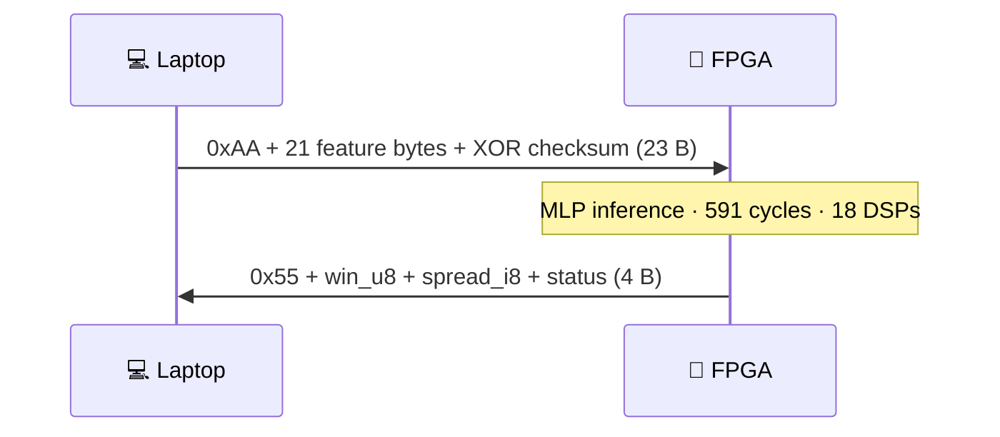
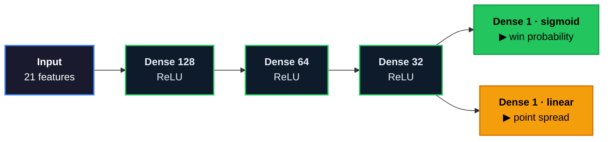

<div align="center">

# 🏈 NFL FPGA Accelerator

**A neural network that predicts NFL games — running on real silicon, not a CPU.**

Train an MLP in Python → quantize it → compile it to Verilog → deploy it on a **Basys 3 FPGA**.
The laptop sends 21 game features over USB-UART; the FPGA runs the whole network in fabric —
**591 cycles, ~5.9 µs, zero jitter** — and returns win probability + point spread in ~3.4 ms
round-trip.


</div>

---

> [!NOTE]
> **The point isn't the football accuracy** — NFL outcomes are close to a coin flip. The point is the
> **complete, verified path from a Keras model to a running hardware accelerator**, proving at every
> step that the silicon computes *exactly* what the software does. The first hardware build
> **deadlocked on real silicon** even though every simulation passed — finding out why, fixing it,
> and getting to bit-exact is the project. Full story: [**PROJECT_DOCUMENT.md**](PROJECT_DOCUMENT.md).

## ⚡ At a glance

| | |
|---|---|
| 🧠 **Model** | 128→64→32 MLP, dual-head (win + spread), **13,218 params**, 8-bit quantized |
| 🎯 **Accuracy** | **64.5%** win (val) · **9.74 pt** spread MAE — beats the always-home *and* Vegas-line baselines |
| 🔩 **Fits** | 17,888 LUT (86%) · 18 DSP (20%) · 7 BRAM on a \$150 board · WNS +0.126 ns @ 100 MHz |
| ⏱️ **Speed** | 591-cycle core (~5.9 µs, deterministic) · ~3.4 ms round-trip incl. USB-UART |
| ✅ **Verified** | **Bit-exact on hardware** — 50/50 real games match RTL sim, zero deviation, zero timeouts |

<div align="center">


</div>

## 🖥️ Demo

<!-- TODO: capture a screenshot/GIF of the web UI running an inference and drop it here:
      -->

Pick any of 6,427 real games (2000–2024) in the web UI, hit **Run** — the 21 feature bytes go
over UART, the FPGA computes the MLP in fabric, and the raw response bytes come back and are
graded against the actual result:

```
python phase7_deploy/ui/webapp.py     # → http://127.0.0.1:8713  (Windows, board on COM port)
```

<div align="center">



</div>

`win_prob = win_u8 / 256` (home team) · `spread` = signed int8 · `status` = `0x00` OK /
`0x01` checksum NACK / `0x02` MLP-watchdog timeout. The UI shows the raw byte (`177/256 = 69.1%`)
to make clear the number came off the chip, not the laptop.

## 🏆 Why this project is interesting

**The silicon is provably correct.** Four independent verification layers — HLS C-sim, RTL
cosimulation, a 50-game XSIM regression against a Python golden, and the physical board — and the
board reproduces the simulated RTL **byte-for-byte across all 50 games**. A feature-sweep test
(inputs that exist in no dataset, output moves smoothly 50%→74%) proves it's computing, not
replaying a table.

**The hardest bug never showed up in simulation.** The first generated IP passed C-sim and a
50-game regression, then deadlocked on the board: a sequential FSM around depth-2 FIFOs, a
template doing 512 destructive reads of a 128-entry stream, and one stream with two consumers.
The sims had passed only because they'd substituted replay FIFOs that weren't in the bitstream.
Diagnosed by auditing the generated Verilog line-by-line; fixed by rebuilding on `io_stream`
dataflow with **RTL cosimulation as a mandatory build gate**. →
[AUDIT_REPORT.md](AUDIT_REPORT.md) · [POST_AUDIT_REMEDIATION.md](POST_AUDIT_REMEDIATION.md)

**398,705 → 17,888 LUTs across seven documented synthesis runs.** First synthesis was 1,917% of
the chip (a deprecated pragma silently ignored → weights in LUT ROM). Every subsequent step is
attributed: BRAM binding, pragma placement, a stream-write drain mux, a DATAFLOW FIFO explosion,
a reuse-factor mux that grows when you'd expect it to shrink. →
[phase4_hls/PHASE4_COMPLETE.md](phase4_hls/PHASE4_COMPLETE.md)

**The model is honest.** Temporal splits only (train ≤2020, val 2021–22, test 2023–24), every
rolling stat behind `.shift(1)` so game *N* never sees its own result, scaler frozen forever, and
every feature decision made on a 5-seed harness because single-run deltas are noise. 9.74-pt
spread MAE edges the Vegas opening line's 9.76 on held-out seasons.

## 🚀 Quickstart

**Software / model path** — Python 3.12, no hardware needed:

```bash
python -m venv venv && source venv/bin/activate
pip install -r requirements.txt
python phase1_data/pipeline.py          # nflreadpy → data/processed/games.parquet
python phase2_model/train.py            # → artifacts/model_best.keras (already committed)
python phase3_quantization/quantize.py  # → artifacts/model_quantized.keras
pytest tests/ -v
```

> [!NOTE]
> `games.parquet` is regenerable (needs internet); the trained artifacts (`model_best.keras`,
> `scaler.pkl`, `features.json`) **are committed** and are the source of truth.

**FPGA / hardware path** — Basys 3 + Vivado 2025.2 (free WebPACK):

```bash
# 1) synthesize — the verified IP is committed under artifacts/ip_repo/
#    (edit the absolute paths in phase5_fpga/scripts/*.tcl for your machine)
vivado -mode batch -source phase5_fpga/scripts/create_project.tcl
vivado -mode batch -source phase5_fpga/scripts/run_synth.tcl

# 2) program top.bit via Vivado Hardware Manager, then:
python phase7_deploy/board/verify_uart.py COM8              # smoke test
python phase7_deploy/validation/golden_vector_test.py COM8  # 50-game bit-exact check
python phase7_deploy/ui/webapp.py                           # web UI
```

> [!TIP]
> One-time FTDI tweak: set the COM port's **Latency Timer 16 → 1 ms** (Device Manager → Advanced).
> That single driver setting took the round-trip from ~11.5 ms to ~3.4 ms — no HDL change.

## 🏗️ Architecture

<div align="center">



</div>

Hidden layers are **ReLU-only** (one comparator in silicon), scaling is **MinMax [0,1]** (drops
straight into an unsigned byte → `ap_fixed<18,6>` fractional bits), and Dropout is training-only
(zero hardware cost). The shared 32-unit trunk feeding two heads is exactly what deadlocked the
first build — two consumers of one stream.

On the FPGA, hand-written Verilog wraps the hls4ml IP:

```
top.v
├── uart_rx.v         8N1 @115200, mid-bit sampling, metastability-hardened
├── uart_tx.v         8N1 transmitter
├── uart_framing.v    SOF · XOR checksum · TX sequencer · dropped-byte resync watchdog
├── mlp_controller.v  packs 21 bytes → one 672-bit AXI-Stream beat · ap_ctrl_hs
│                     handshake · win saturation · 1 ms inference watchdog
└── myproject         hls4ml io_stream MLP IP (591-cycle latency)
```

## 📊 Results

| Layer | Result | Context |
|:---|:---|:---|
| Model (val, 543 games) | **64.5%** win acc · AUC 0.710 | always-home 53.6% · Vegas +0.2% gap |
| Spread (val) | **9.74 pt MAE** | Vegas opening line 9.76 — model edges it |
| Model (test, 544 games) | 70.2% win acc | held out, evaluated once |
| Quantization (8-bit QAT) | **−0.2% accuracy** · +0.01 MAE | effectively free |
| HLS C-sim vs Python | mean Δ 0.047 · max 0.096 | within 0.05/0.10 gates |
| Vivado post-route | 17,888 LUT (86%) · WNS **+0.126 ns** | HLS *estimated* 28,869 — gate on real numbers |
| XSIM 50-game regression | 0 timeouts · 40/40 confident winners | win Δ matches predicted fixed-point envelope |
| **Board, 50 games** | **bit-exact vs sim: max Δ = 0** | zero timeouts, zero framing errors |
| Round-trip latency | 11.5 ms → **3.4 ms** | FTDI latency-timer 16→1 ms; MLP itself: 6 µs |

## 🗂️ Repo map & documentation

| Path | Contents |
|---|---|
| [`PROJECT_DOCUMENT.md`](PROJECT_DOCUMENT.md) | **The complete technical account** — every decision, alternative, bug, and result |
| [`AUDIT_REPORT.md`](AUDIT_REPORT.md) / [`POST_AUDIT_REMEDIATION.md`](POST_AUDIT_REMEDIATION.md) | The deadlock forensics and the fix campaign |
| `phase1_data/` → `phase7_deploy/` | The seven phases — each with a `PHASE*_COMPLETE.md` deep-dive |
| `artifacts/` | **Committed & sacred:** `model_best.keras` · `scaler.pkl` · `features.json` · verified `ip_repo/` |
| `phase5_fpga/hdl/` | Hand-written Verilog (UART · framing · controller · top) |
| `phase6_sim/` | cocotb unit tests + the real-IP XSIM functional regression |
| `phase7_deploy/ui/` | Tkinter desktop app + stdlib-only web app |
| `tests/` | pytest suites, one per phase |

## ⚖️ Honest limitations

> [!WARNING]
> - **Prediction quality is modest by design** — ~64.5% / 9.7 pt MAE is near the practical ceiling
>   for schedule-level features. This is a *systems* project, not a betting edge.
> - **The bitstream is volatile** — reprogram after every power cycle.
> - **Not clone-and-go for hardware** — you synthesize the bitstream yourself, own a Basys 3, and
>   fix a few hardcoded paths. The software half *is* fully reproducible.

---

<div align="center">

### 🛠️ Stack

**Python** · nflreadpy · pandas · scikit-learn · TensorFlow/Keras · QKeras · hls4ml · pyserial · pytest
**FPGA** · Vivado / Vitis HLS 2025.2 · Verilog · Basys 3 (Artix-7 XC7A35T) · USB-UART @ 115200

*From `pandas` to `.bit` — and verified bit-exact on the way down.*

</div>
