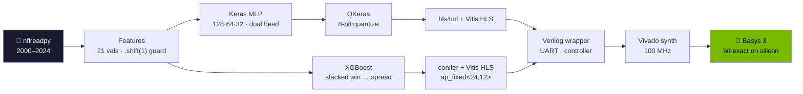
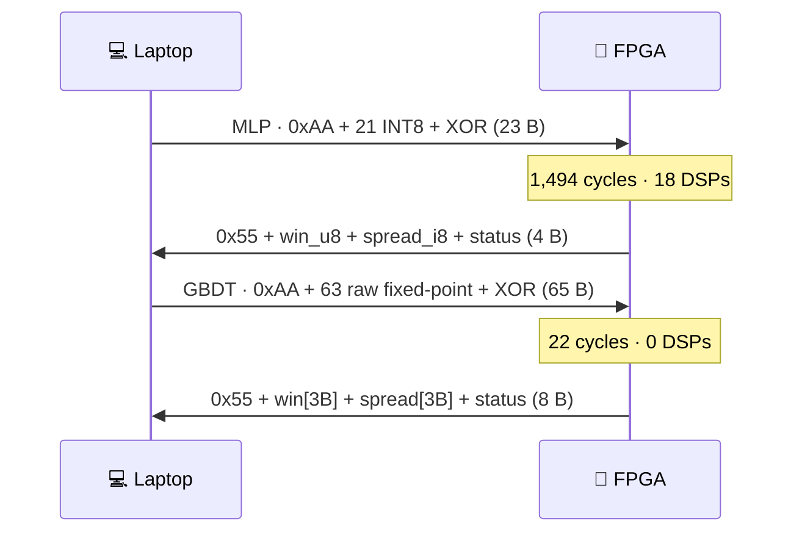
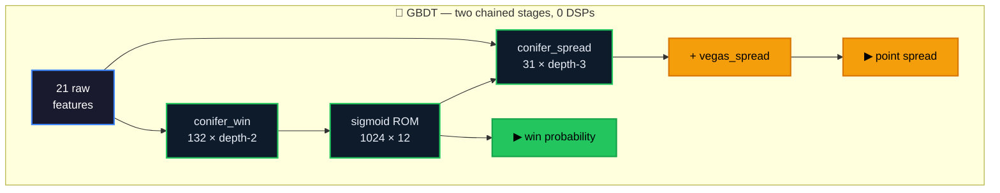

<div align="center">

# 🏈 NFL FPGA Accelerator

**Two machine-learning models that predict NFL games — both running on real silicon, not a CPU.**

Train in Python → compile to Verilog → deploy on a **Basys 3 FPGA**. The laptop sends 21 game
features over USB-UART; the FPGA runs the entire model in fabric and returns win probability +
point spread. Two complete tracks share one dataset and one locked feature set: an **MLP** via
hls4ml, and a **stacked GBDT** via conifer.


</div>

---

> [!NOTE]
> **The point isn't the football accuracy** — NFL outcomes are close to a coin flip. The point is the
> **complete, verified path from a trained model to a running hardware accelerator**, proving at every
> step that the silicon computes *exactly* what the software does. The MLP's first hardware build
> **deadlocked on real silicon** even though every simulation passed. The GBDT track then asked a
> harder question — *is a neural network even the right choice here?* — and answered it on the same
> board, with a stricter correctness gate.

## ⚡ At a glance

| | 🧠 MLP (hls4ml) | 🌲 GBDT (conifer) |
|---|---|---|
| **Model** | 128→64→32 dual-head, 13,218 params, 8-bit QAT | Stacked XGBoost: 132×d2 win + 31×d3 spread |
| **Win accuracy** (val / test) | 64.5% / 70.2% | **65.8%** / 70.2% |
| **Spread MAE** (val) | **9.74** | 9.758 — both tie the Vegas line (9.76) |
| **Fits** | 17,888 LUT (86%) · **18 DSP** · 7 BRAM | **12,095 LUT (58%)** · **0 DSP** · 0.5 BRAM |
| **Timing** | WNS +0.126 ns | WNS **+0.965 ns** |
| **Inference** | 1,494 cycles (591-cycle IP core) | **22 cycles** — 68× fewer |
| **Board vs sim** | 50/50 bit-exact (±2-count tolerance) | **100/100 bit-exact, zero tolerance** |
| **Round-trip** | **3.4 ms** (23-byte packet) | 6.9 ms (65-byte packet, line-time bound) |

> The trees win on accuracy, area, DSPs, timing slack and compute latency. Their only loss is
> wall-clock round-trip — and that's a *protocol* choice (full-width results to enable
> zero-tolerance verification), not a property of the model.

<div align="center">



</div>

## 🖥️ Demo

Pick any of 6,427 real games (2000–2024) in the web UI, hit **Run** — the feature bytes go over
UART, the FPGA computes in fabric, and the raw response bytes come back graded against the actual
result. Both tracks serve the **same page**, which reads its model badge, pipeline labels and
number formats from the server:

```
python mlp/phase7_deploy/ui/webapp.py         # → http://127.0.0.1:8713   (needs top.bit)
python gbdt/phase7_deploy/ui/webapp_gbdt.py   # → http://127.0.0.1:8714   (needs top_gbdt.bit)
```

<div align="center">



</div>

The two bitstreams speak **different protocols and are not interchangeable** — the GBDT uses raw,
unscaled features (`home_elo ≈ 1522` cannot fit in a byte), so each value crosses as a full 24-bit
`ap_fixed<24,12>` word. Returning full-width results costs 42 extra bytes per request and buys
something valuable: the board's output is *exactly* comparable to simulation, with no tolerance
band to hide behind.

## 🏆 Why this project is interesting

**The silicon is provably correct — four independent implementations agree bit-for-bit.** For the
GBDT: the XGBoost/C++ emulation golden, the conifer HLS cosim, XSIM on the synthesized netlists,
and the physical board all produce identical 24-bit words across 100 games, with **zero tolerance**.

**Zero-tolerance verification paid for itself three times.** Demanding exactness caught three
separate 1-ulp bugs that a tolerance band would have swallowed silently — two before hardware
existed. The worst: the host encoder read features as float64 while the golden cast to float32
first, shifting the LSB on **48 of 100 games**. On hardware that would have looked like a board
that is *mostly* bit-exact, failing half the games for no visible reason.

**The hardest bug never showed up in simulation.** The MLP's first IP passed C-sim and a 50-game
regression, then deadlocked on the board: a sequential FSM around depth-2 FIFOs, a template doing
512 destructive reads of a 128-entry stream, and one stream with two consumers. The sims had passed
only because they'd substituted replay FIFOs that weren't in the bitstream. Fixed by rebuilding on
`io_stream` dataflow with **RTL cosimulation as a mandatory build gate**.
→ [`docs/AUDIT_REPORT.md`](docs/AUDIT_REPORT.md) · [`docs/POST_AUDIT_REMEDIATION.md`](docs/POST_AUDIT_REMEDIATION.md)

**Never trust the HLS estimate — proven twice.** The MLP's first synthesis was 1,917% of the chip
(a deprecated pragma silently ignored → weights in LUT ROM), ending at 17,888 LUTs across seven
documented runs. The GBDT's csynth *estimated* 96,878 + 33,369 LUTs — implying neither stage could
ever fit. Real Vivado synthesis: 6,758 + 5,111. Inflated **14× and 6.5×**.

**You can see the trees from outside the chip.** Sweeping `elo_diff` with all other features pinned
produces a **staircase, not a ramp** — 8 discrete levels with flat plateaus, which is the depth-2
split structure made visible. It is also monotonic, meaning the training-time monotone constraint
survived XGBoost → conifer → HLS → fixed-point → silicon intact. The MLP's equivalent sweep moves
smoothly; neither can be produced by a lookup table.

**The models are honest.** Temporal splits only (train ≤2020, val 2021–22, test 2023–24), every
rolling stat behind `.shift(1)` so game *N* never sees its own result, scaler frozen forever,
out-of-fold stacking so the spread head never trains on leaked win probabilities, and every feature
decision validated across multiple seeds because single-run deltas are noise.

## 🚀 Quickstart

**Software / model path** — Python 3.12, no hardware needed:

```bash
python -m venv venv && source venv/bin/activate
pip install -r requirements.txt
python phase1_data/pipeline.py               # nflreadpy → data/processed/games.parquet
python mlp/phase2_model/train.py             # → artifacts/model_best.keras     (committed)
python mlp/phase3_quantization/quantize.py   # → artifacts/model_quantized.keras
python gbdt/phase2_train/train_gbdt.py       # → artifacts/gbdt/*.json          (committed)
pytest tests/ -v
```

> [!NOTE]
> `games.parquet` is regenerable (needs internet); the trained artifacts (`model_best.keras`,
> `scaler.pkl`, `features.json`, `artifacts/gbdt/`) **are committed** and are the source of truth.
> The GBDT deliberately does **not** use `scaler.pkl` — trees split on raw thresholds.

**FPGA / hardware path** — Basys 3 + Vivado 2025.2 (free WebPACK):

```bash
# 1) synthesize (edit the absolute paths in */phase5_fpga/scripts/*.tcl for your machine)
vivado -mode batch -source gbdt/phase5_fpga/scripts/create_project.tcl
vivado -mode batch -source gbdt/phase5_fpga/scripts/run_synth.tcl

# 2) rebuild the host-side catalogs once, in WSL/Linux
python gbdt/phase7_deploy/export_catalog_gbdt.py

# 3) program top_gbdt.bit via Vivado Hardware Manager, then:
python gbdt/phase7_deploy/board/verify_uart_gbdt.py COM8              # smoke test
python gbdt/phase7_deploy/validation/golden_vector_test_gbdt.py COM8  # 100-game bit-exact
python gbdt/phase7_deploy/ui/webapp_gbdt.py                           # web UI
```

Swap `gbdt/` → `mlp/` (and drop the `_gbdt` suffixes) for the MLP track.

> [!TIP]
> One-time FTDI tweak: set the COM port's **Latency Timer 16 → 1 ms** (Device Manager → Advanced).
> That single driver setting took the MLP round-trip from ~11.5 ms to ~3.4 ms — no HDL change.
> Profile before optimizing: the obvious suspect (baud rate) was only ~20% of the latency.

## 🏗️ Architecture

<div align="center">



</div>

The GBDT's spread head predicts the **residual to the Vegas line**, which is added back at the end
— one adder in hardware. That reframing matters: predicting the raw spread scored *worse* than the
line itself in all 27 sweep configs, because game margin is nearly linear in the line and trees
approximate a line as a high-variance staircase.

The hardware sigmoid has **no Python counterpart**, so `gbdt/phase6_sim/make_chain_golden.py`
*is* its specification — it emits the `sigmoid_lut.mem` that `sigmoid_rom.v` loads with
`$readmemh`. One artifact, so the model and the ROM cannot drift.

The MLP is a 128→64→32 ReLU trunk feeding two heads (win: sigmoid, spread: linear). Hidden layers
are ReLU-only (one comparator in silicon) and scaling is MinMax [0,1] (drops straight into an
unsigned byte). That shared trunk feeding two heads is exactly what deadlocked the first build —
two consumers of one stream.

```
gbdt/phase5_fpga/hdl/top_gbdt.v          mlp/phase5_fpga/hdl/top.v
├── uart_rx.v / uart_tx.v  ← sourced from mlp/phase5_fpga/hdl (single source of truth)
├── uart_framing_conifer.v   65B/8B protocol       ├── uart_framing.v    23B/4B protocol
├── gbdt_controller.v        chains both IPs       ├── mlp_controller.v  AXI-Stream beat
├── sigmoid_rom.v            1024 × 12 ROM         └── myproject         hls4ml io_stream IP
└── conifer_win + conifer_spread
```

## 📊 Results

| Layer | MLP | GBDT |
|:---|:---|:---|
| Win accuracy (val, 543 games) | 64.5% · AUC 0.710 | **65.8%** · AUC **0.716** |
| Win accuracy (test, 544 games) | 70.2% · AUC 0.724 | 70.2% · AUC **0.731** |
| Spread MAE (val / test) | **9.74** / 9.86 | 9.758 / **9.776** |
| Fixed-point fidelity | 8-bit QAT: −0.2% acc | `ap_fixed<24,12>`: 99.26% agreement |
| HLS estimate vs real | 28,869 → 17,888 LUT | 130,247 → **11,869** LUT |
| Vivado post-route | 17,888 LUT (86%) · WNS +0.126 ns | **12,095 LUT (58%)** · WNS **+0.965 ns** |
| XSIM regression | 50 games · 0 timeouts | **100/100 bit-exact** · 0 timeouts |
| **Board** | **50/50 bit-exact vs sim** | **100/100 bit-exact, zero tolerance** |
| Round-trip latency | 11.5 → **3.4 ms** | 6.9 ms median (6.34 ms is line time) |

Both models tie the Vegas opening line on spread (9.76) and neither beats it — that is the **data's
noise floor**, not a modeling failure. The line already prices in everything these 21 features
contain.

## 🗂️ Repo map

```
phase1_data/      shared data pipeline          artifacts/   committed & sacred:
tests/            pytest, one suite per phase                model_best.keras · scaler.pkl
docs/             audit + remediation reports                features.json · gbdt/*.json

mlp/              phase2_model · phase3_quantization · phase4_hls
                  phase5_fpga · phase6_sim · phase7_deploy

gbdt/             phase2_train · phase4_hls · phase5_fpga · phase6_sim · phase7_deploy
                  (no phase3 — trees need no scaler or quantization stage)
```

Each phase folder carries its own `PHASE*_COMPLETE.md` deep-dive: what was built, what broke, and
the numbers that closed it.

> [!IMPORTANT]
> **Cross-track references are deliberate.** The GBDT *sources* `uart_rx.v`/`uart_tx.v` and
> `basys3.xdc` from `mlp/phase5_fpga/`, imports `GameCatalog` from `mlp/phase7_deploy/`, subclasses
> the MLP's `FeatureBuilder`, and both UIs serve the same model-driven `index.html`. Single source
> of truth — don't fork them.

## ⚖️ Honest limitations

> [!WARNING]
> - **Prediction quality is modest by design** — ~65% / 9.7 pt MAE is near the practical ceiling for
>   schedule-level features. This is a *systems* project, not a betting edge.
> - **The GBDT's fixed-point path disagrees with float XGBoost on 0.7% of games** (4 of 543), from
>   conifer's threshold-rounding convention. Unfixable by bit width, accepted, and invisible to the
>   golden-based verification — but real.
> - **The bitstream is volatile** — reprogram after every power cycle. Only one bitstream is loaded
>   at a time, so the model you can run is whichever you last flashed.
> - **Board tests need hardware**, so they can't run in CI. They're gated behind `FPGA_PORT`.
> - **Not clone-and-go for hardware** — you synthesize the bitstream yourself, own a Basys 3, and
>   fix a few absolute paths. The software half *is* fully reproducible.

---

<div align="center">

### 🛠️ Stack

**Python** · nflreadpy · pandas · scikit-learn · TensorFlow/Keras · QKeras · XGBoost · hls4ml · conifer · pyserial · pytest
**FPGA** · Vivado / Vitis HLS 2025.2 · Verilog · Basys 3 (Artix-7 XC7A35T) · USB-UART @ 115200

*From `pandas` to `.bit` — twice, and verified bit-exact on the way down.*

</div>
